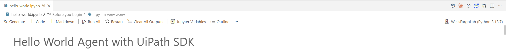

# Company Agent with UiPath - Prerequisites and Setup

This repository contains a sample implementation of a Company Agent with UiPath, demonstrating how to build enterprise-grounded AI agents that can access company policies, handle procurement requests, and manage HR tasks.

Before getting started, check the [PRERESUISITES.md](./PRERESUISITES.md).

## Getting Started

:warning: ***Go through thesese seteps before before the lab if you plan to follow along using the jupyter notebook on your own device.***

1. **Clone the repository**:
   ```bash
   git clone <repository-url>
   cd prodev-lab
   ```

2. **Run prerequisites checker** (optional but recommended):

   Before getting started, you can run the prerequisites checker script to verify all required software is installed. These scripts will check for: `UV Package Manager`, `git`, `Node.js (v14.0+)`, `npm`, `Jupyter`, `Cursor`.

   ```bash
   # Windows
   .\resources\prerequisites\check-prerequisites.ps1

   # macOS/Linux
   chmod +x ./resources/prerequisites/check-prerequisites.sh
   ./resources/prerequisites/check-prerequisites.sh
   ```

   Follow the instructions and install any missing software.

3. **Set up the virtual environment**:

   This will initialize you virtual environment and will add the jupyter requirements.
   There are multiple ways of setting up the jupyter kernel. If you are using this method, make sure you restart `cursor` after creating the jupyter kernel.
 
   ```bash
   uv init -p 3.11
   uv add ipykernel jupyter
   uv run python -m ipykernel install --user --name=jupyter-uv-env --display-name "FUSION2025"
   ```

4. **Environment Variables** (`.env` file - optiona, you will create it in the `hello-world.ipynb` if needed):
   Create a `.env` file in the project root with:
   ```bash
   echo "
   UIPATH_FOLDER_PATH=Payments  # or your specific folder
   ANTHROPIC_API_KEY=your-anthropic-api-key
   " >> .env
   ```

5. **Run the Jupyter Notebook With Cursor**:

   ```bash
   cursor .
   ```

   First open the `hello-world.ipynb` file.

   Install the recommended `Python` + `Jupyter` extensions

   
   
   
   

7. **Select the kernel**:
   - In Jupyter, select Kernel > Change Kernel
   - Choose the Jupyter kernel you created

   
   
   

## Support

For issues and questions:
- UiPath Documentation: https://docs.uipath.com/
- UiPath Community Forum: https://forum.uipath.com/
- GitHub Issues: [Create an issue in this repository]

## License

This is a sample project for educational purposes. Please refer to your organization's licensing agreements for UiPath and AI model usage.
